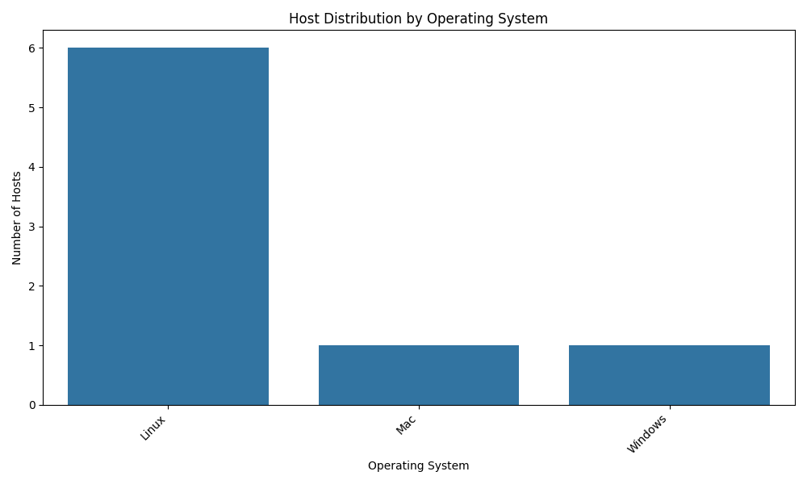
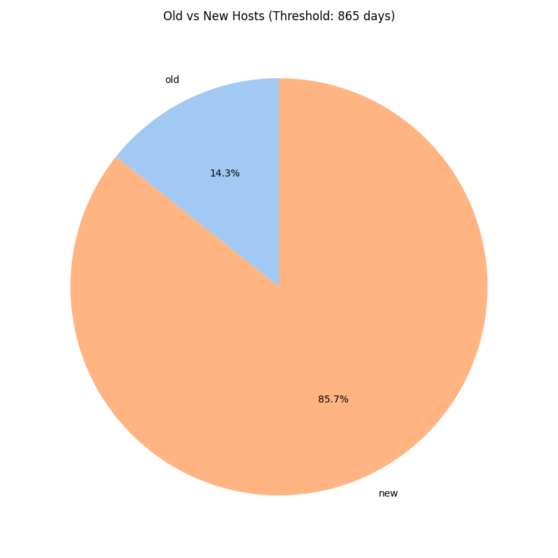
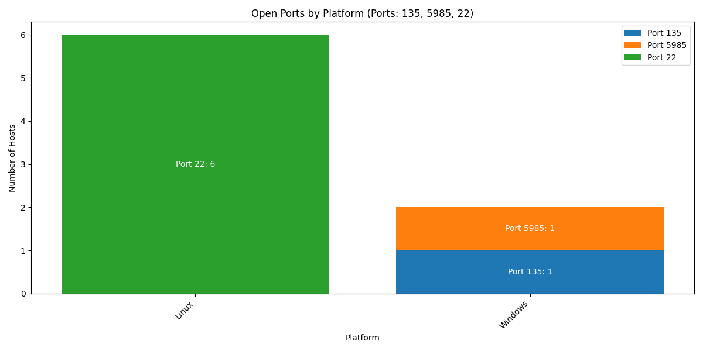
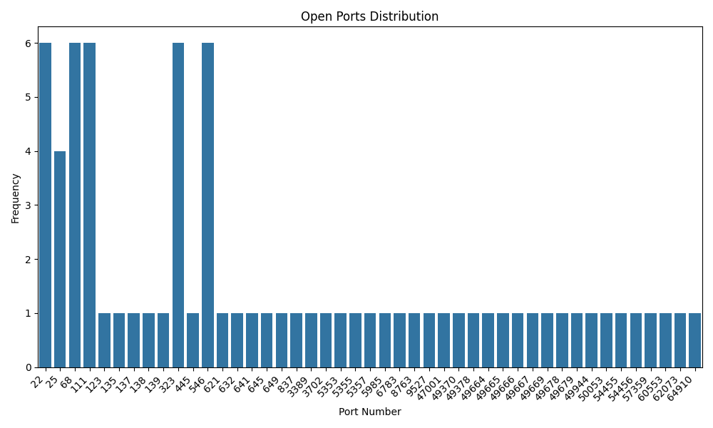

# data-pipeline-mongo

Software/Data Engineer Exercise

## Table of Contents

- [About This Project](#about-this-project)
  - [Motivation](#motivation)
  - [Project structure](#project-structure)
- [Project Documentation](#project-documentation)
  - [Prerequisites](#prerequisites)
  - [Local Deployment](#local-deployment)
  - [Plots Examples](#plots-examples)

## About this project

### Motivation

This project represents the data pipeline in which data about hosts is extracted from source (some API), stored into 
separate MongoDB collections for each source, normalized and deduplicated/merged into the final collection. 

- Also some api endpoints are provided:
    - To execute the pipeline
    - To generate a plot with demonstrating the distribution of host by operating system
    - To generate a plot with demonstrating the distribution of old and new found hosts
    - To generate a plot with demonstrating the distribution of open ports
    - To generate a plot with demonstrating the distribution of open ports by each found OS

### Project structure

```text
.
├── configs
│   ├── logging_config.json
│   └── pipeline_config.json             # Pipeline config ¯\_(ツ)_/¯
├── docker
│   ├── Dockerfile
│   └── entrypoint.sh
├── docker-compose.yaml
├── flying_walrus_game_score_setter.sh
├── Makefile
├── pyproject.toml
├── README.md
├── src                                  # Main application code
│   ├── cli.py
│   ├── commands
│   │   ├── database.py
│   │   └── pipeline.py 
│   ├── core                             # Entities and ports
│   │   ├── entities.py
│   │   └── ports
│   │       ├── api_client.py
│   │       ├── merger.py
│   │       ├── normalizer.py
│   │       └── repositories.py
│   ├── infrastructure                   # Infrastructure layer (API, DB, ports implementations)
│   │   ├── api                          # FastAPI-application
│   │   │   ├── app.py
│   │   │   ├── dependencies.py
│   │   │   ├── pipeline
│   │   │   │   └── endpoints.py
│   │   │   ├── plots
│   │   │   │   └── endpoints.py
│   │   │   └── utils.py
│   │   ├── db
│   │   │   └── mongo
│   │   │       ├── client.py
│   │   │       ├── migrations.py
│   │   │       └── repositories.py
│   │   ├── dependencies.py
│   │   ├── pipeline.py
│   │   ├── ports                        # Ports implementation
│   │   │   ├── api_clients
│   │   │   │   ├── crowdstrike_api_client.py
│   │   │   │   └── qualys_api_client.py
│   │   │   ├── mergers
│   │   │   │   └── priority_merger.py
│   │   │   └── normalizers
│   │   │       ├── crowdstrike_normalizer.py
│   │   │       └── qualys_normalizer.py
│   │   └── utils.py
│   ├── application                      # Use cases
│   │   └── services
│   │       ├── deduplication_service.py
│   │       ├── fetching_service.py
│   │       └── normalization_service.py
│   └── settings.py
└── uv.lock
```

### Project documentation

#### Prerequisites

`docker` and 'docker compose' should be installed.

#### Local Deployment

1. Run:
```bash
make build
```
2. Run:
```bash
cp .env.example .env
```
3. Set API tokens in `.env` file.
4. Run (notice that the implemented pipeline is executed to fill collections, see `docker/entrypoint.sh`):
```bash
make up
```
5. Go to [api docs link](http://localhost:8000/docs) to try endpoints or
go to [mongo express page](http://localhost:8081/) to manage changes in collections.

#### Plots examples

#### Host Distribution by OS


#### Old vs New Hosts


#### Open Ports by Platform Distribution


#### Open Ports Distribution

